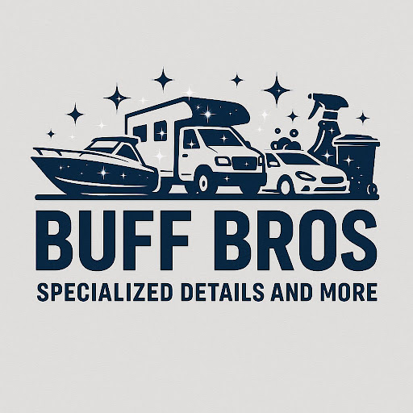

<!DOCTYPE html>
<html lang="en">
<head>
  <meta charset="UTF-8" />
  <meta name="viewport" content="width=device-width, initial-scale=1.0"/>
  <title>Buff Bros | Car Detailing</title>
  
</head>
<body>

  <header>
    
    <h1>Buff Bros</h1>
    
Specialized Details and More

  </header>

  <nav>
    <a href="#services">Services</a>
    <a href="#gallery">Gallery</a>
    <a href="#process">Our Process</a>
    <a href="#contact">Contact</a>
  </nav>

  <section id="services" class="section">
    <h2>Pricing</h2>
    

      <h3>Interior Only</h3>
      
Starting at <strong>$150</strong>

      <ul>
        <li>Level 1: no extra cost</li>
        <li>Level 2: +$20</li>
        <li>Level 3: +$40</li>
      </ul>

      <h3>Exterior Wash</h3>
      
$40

      <h3>Wax</h3>
      
$30

      <h3>Combo Package</h3>
      
<strong>Interior + Exterior + Wax = $20 off</strong>

    

  </section>

  <section id="gallery" class="section">
    <h2>Image Gallery</h2>
    

      
      
      
      
    

  </section>

  <section id="process" class="section">
    <h2>Our Process</h2>
    
We take pride in delivering the highest quality detailing service with care and precision. Here's how we do it:

    <ul>
      <li>Vacuuming and deep interior clean</li>
      <li>Stain treatment and surface shampooing</li>
      <li>Dashboard, vents, and trim detailed</li>
      <li>Hand wash exterior and tire shine</li>
      <li>Waxing and optional polish upgrade</li>
      <li>Final inspection and client satisfaction check</li>
    </ul>
  </section>

  <section id="contact" class="contact">
    <h2>Contact Us</h2>
    
<strong>Cole Thomas</strong>

    
Phone: <a href="tel:5038034083">503-803-4083</a>

    
Email: <a href="mailto:Elocstarr@icloud.com">Elocstarr@icloud.com</a>

  </section>

  <footer>
    &copy; 2025 Buff Bros. All rights reserved.
  </footer>
<form action="https://formspree.io/f/xeogpkdl" method="POST">
  <label for="name">Name:</label>
  <input type="text" id="name" name="name" required>

  <label for="email">Email:</label>
  <input type="email" id="email" name="email" required>

  <label for="message">Message:</label>
  <textarea id="message" name="message" required></textarea>

  <button type="submit">Send</button>
</form>
</body>
</html>
